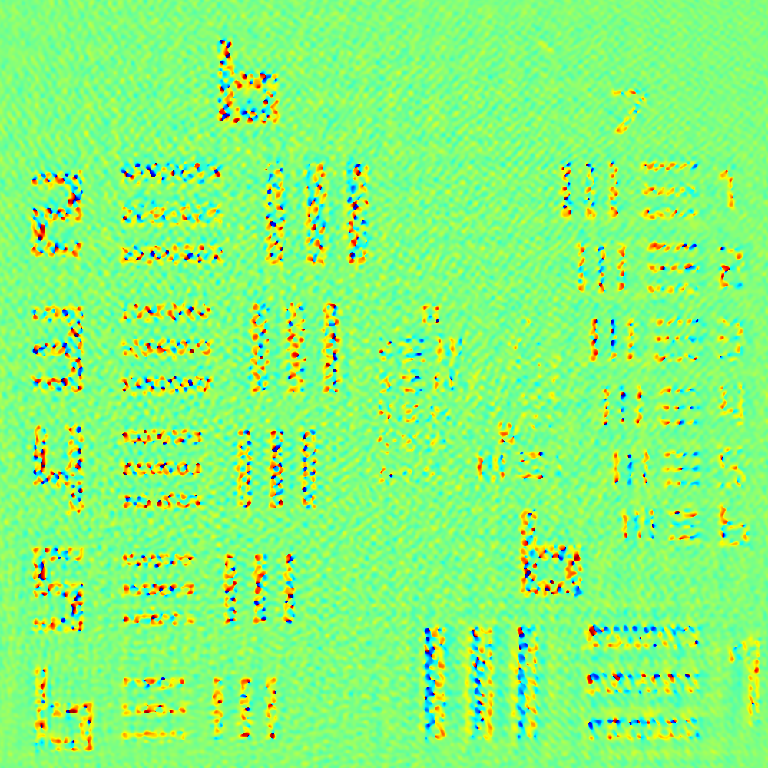
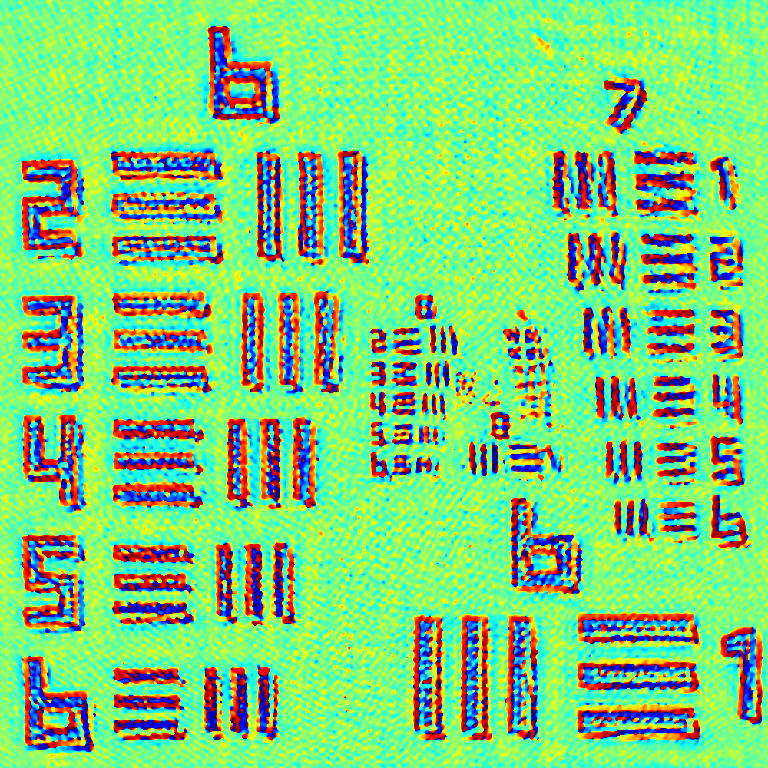

**Disclaimer:** This image is presented solely for illustrative purposes. No fine-tuning of algorithm parameters has been conducted, and it does not represent the optimal outcome. It serves as a visual aid and may not precisely reflect the results presented in the final published article. The colormap used throughout is consistently jet, and the image corresponds to the standard USAF resolution version.

I employed a fully convolutional image fusion network for intensity-domain image fusion. Under typical conditions, this approach significantly enhances phase information. However, in the presence of stray light, it plays a crucial role in the recovery of phase information, rendering the phase visibly clear. Conversely, a single photo without image fusion, using the same alternating projection algorithm, results in phase details that are entirely unusable.
The image focuses on the center of the USAF resolution version.

Subsequent images illustrate the recovery results using the alternating projection algorithm under conditions with stray light.

The images below showcase a noteworthy improvement achieved by utilizing the image fusion algorithm for enhancement, followed by the recovery using the alternating projection algorithm.

