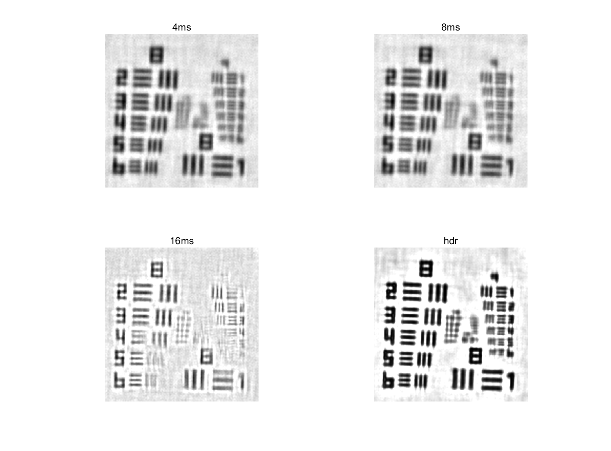
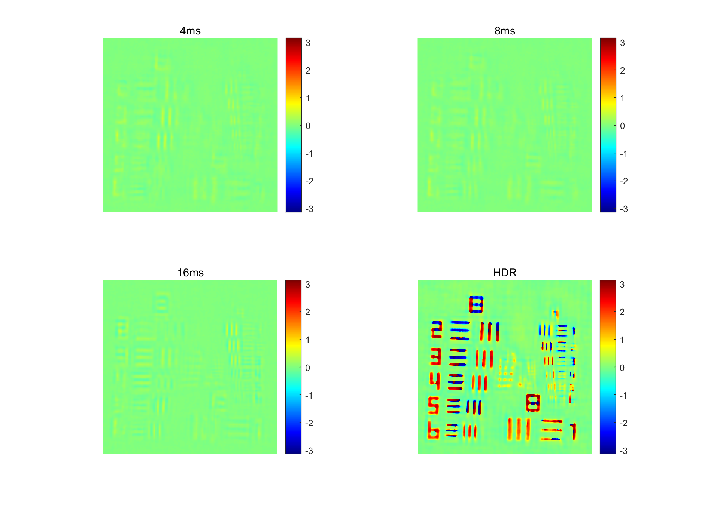
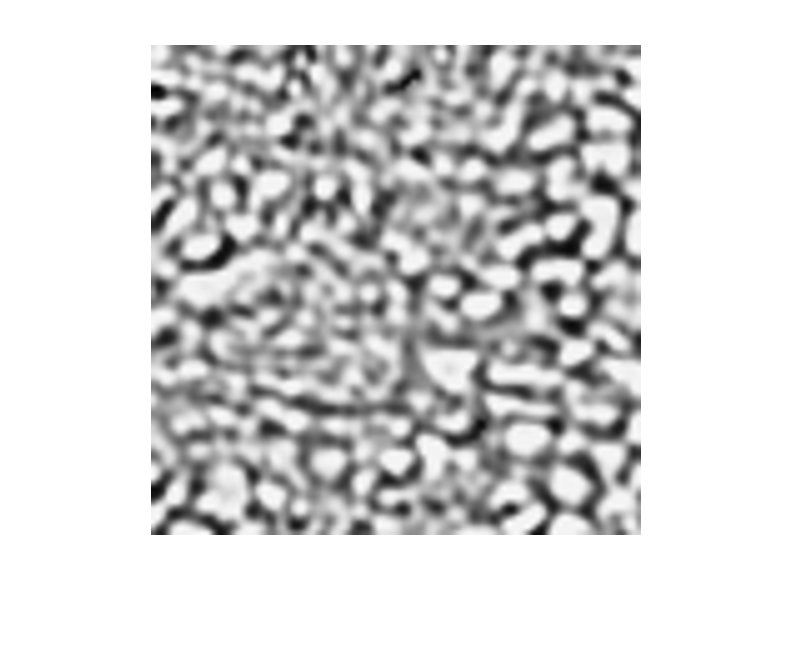
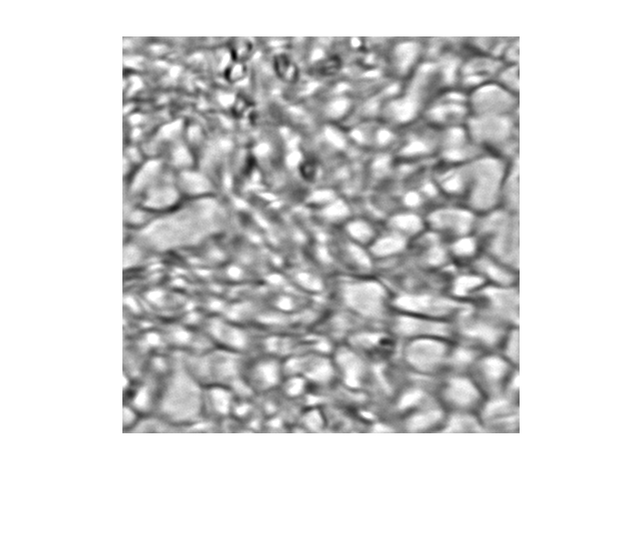
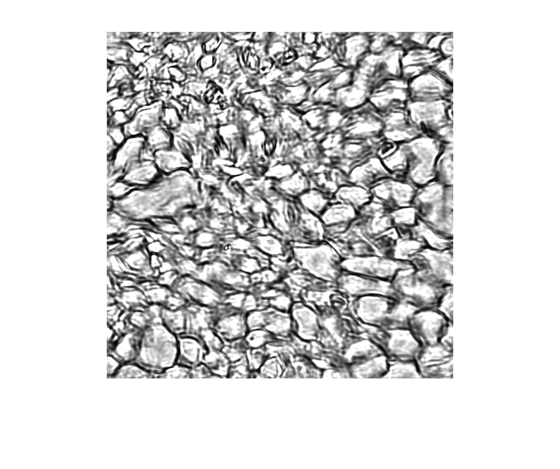
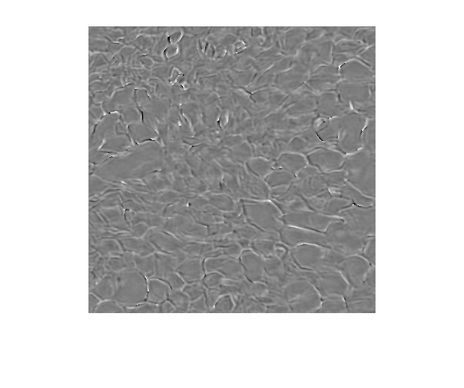

## Introduction to  Image Fusion + FPM

**Disclaimer:** This image is presented solely for illustrative purposes. No fine-tuning of algorithm parameters has been conducted, and it does not represent the optimal outcome. It serves as a visual aid and may not precisely reflect the results presented in the final published article. 

I employed a fully convolutional image fusion network for intensity-domain image fusion. The model aids in recovering intensity and significantly facilitates phase recovery, as depicted in the results below (the FPM algorithm referred to in the text is the FPM-WSI algorithm).

  

Subsequent images illustrate the recovery results for USAF under conditions of stray light using the FPM algorithm for different exposure times, along with the results of neural network data preprocessing.

Following that, the images demonstrate the recovery results for biological samples under conditions of stray light using the FPM algorithm for different exposure times, along with the results of neural network data preprocessing. The five images correspond to the central bright-field image, intensity map recovered by FPM, intensity map recovered by neural network preprocessing followed by FPM, phase map recovered by FPM, and phase map recovered by neural network preprocessing followed by FPM, respectively.

+ central bright-field image

+ intensity map recovered by FPM

+ intensity map recovered by neural network preprocessing followed by FPM

+ phase map recovered by FPM

+ phase map recovered by neural network preprocessing followed by FPM

