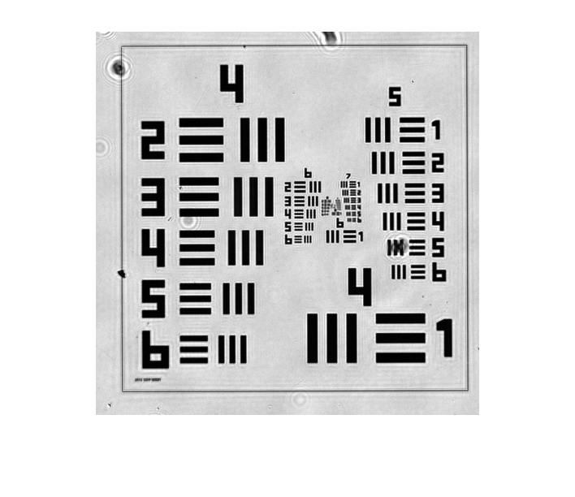
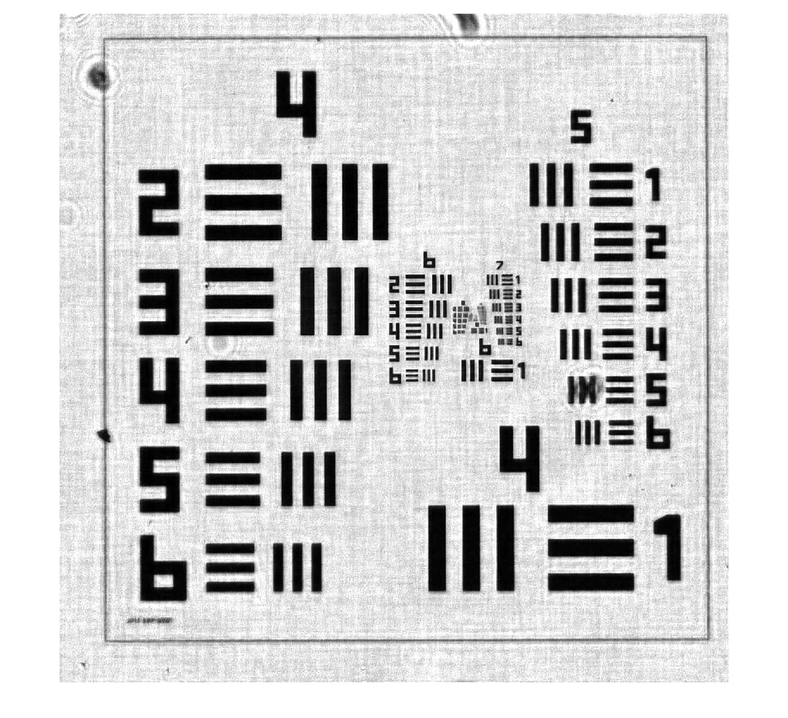

**Disclaimer:** This image is presented for illustrative purposes only. No fine-tuning of algorithm parameters has been conducted, and it does not represent the optimal outcome. It serves as a visual aid and may not precisely reflect the results presented in the final published article. The observed target in this image is the standard 1951 USAF Resolution Calculator, observed using a single lens system.

I applied an algorithm currently under investigation in our laboratory and found that, due to its characteristics, it can theoretically perform single-lens FPM imaging, effectively minimizing interference from second-phase components. Here, only eight images were used for recovery, selected based on NA matching. The algorithm's notable advantage lies in its ability to achieve single-shot recovery. The results presented below have not undergone block-wise reconstruction.

The image corresponds to the center of the USAF Resolution Calculator.

The following images depict the results before reconstruction, showcasing clear resolution of 7 groups with 2 elements.

The subsequent images showcase the results after recovery using the algorithm, discerning 8 groups with 1 element (from a specific trial, not the optimal result). However, under incoherent illumination, only 7 groups with 5 elements are observable.

