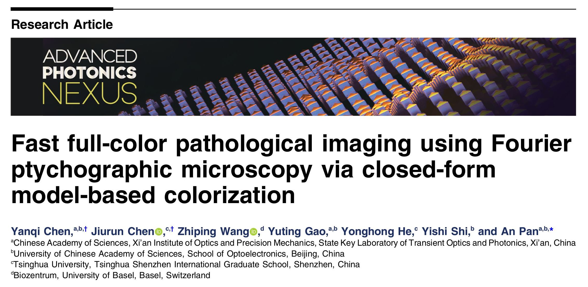
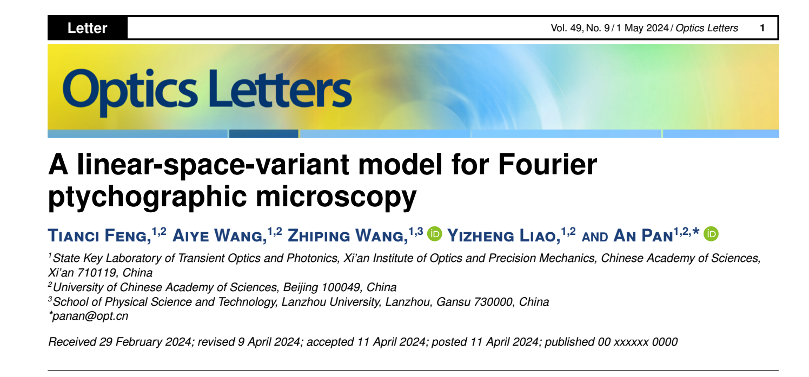
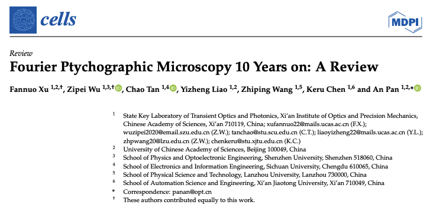

# Publications

## Under Review

---

## Accepted Papers

### Title: Fusion-Based Enhancement of Multi-Exposure Fourier Ptychographic Microscopy
- Authors: <u>Zhiping Wang</u>, Tianci Feng, Aiye Wang, and An Pan.
- Status: Accepted by Advanced Photonics Nexus.

### Title: Wide-Field Quantitative Phase Imaging Without Slicing Via Feature-Domain Fourier Ptychographic Microscopy

- Authors: Fannuo Xu †, <u>Zhiping Wang</u> †, Zipei Wu and An Pan.
- Link: [Elsevier](https://www.sciencedirect.com/science/article/pii/S0030399225003159?via%3Dihub)
- DOI: [10.1016/j.optlastec.2025.112727](https://doi.org/10.1016/j.optlastec.2025.112727)
  

### Title: Fast full-color pathological imaging using Fourier ptychographic microscopy via closed-form model-based colorization

- Authors: Yanqi Chen, Jiurun Chen, <u>Zhiping Wang</u>, Yuting Gao, Yhonghong He, Yishi Shi, and An Pan. 
- Link: [SPIE](https://www.spiedigitallibrary.org/journals/advanced-photonics-nexus/volume-4/issue-2/026001/Fast-full-color-pathological-imaging-using-Fourier-ptychographic-microscopy-via/10.1117/1.APN.4.2.026001.full)
- DOI: [10.1117/1.APN.4.2.026001](https://doi.org/10.1117/1.APN.4.2.026001)
  
### Title: Linear-Space-Variant Model for Fourier Ptychographic Microscopy

- Authors: Tianci Feng, Aiye Wang, <u>Zhiping Wang</u>, and An Pan.
- Link: [Optica](https://opg.optica.org/ol/abstract.cfm?uri=ol-49-10-2617)
<!-- - PDF Download: [PDF](./cells-13-00324.pdf) -->
- DOI: [10.1364/OL.522745](https://doi.org/10.1364/OL.522745)

### Title: Fourier Ptychographic Microscopy 10 Years on: A Review

- Authors: Fannuo Xu, Zipei Wu, Chao Tan, Yizheng Liao, <u>Zhiping Wang</u>, Keru Chen, and An Pan
- Link: [MDPI](https://www.mdpi.com/2073-4409/13/4/324)
- PDF Download: [PDF](./cells-13-00324.pdf)
- DOI: [10.3390/cells13040324](https://doi.org/10.3390/cells13040324)

## Thesis
### Title: Exploring Advancements in Slicing-free Fourier Ptychographic Microscopy
- Instructor: Dr. Hao Jia (Lanzhou University and KAUST) and Dr. An Pan (Chinese Academy of Sciences)
- Summarized some of my work on Fourier Ptychographic Microscopy.
- Achieved an excellent rating for my thesis through oral defense.
